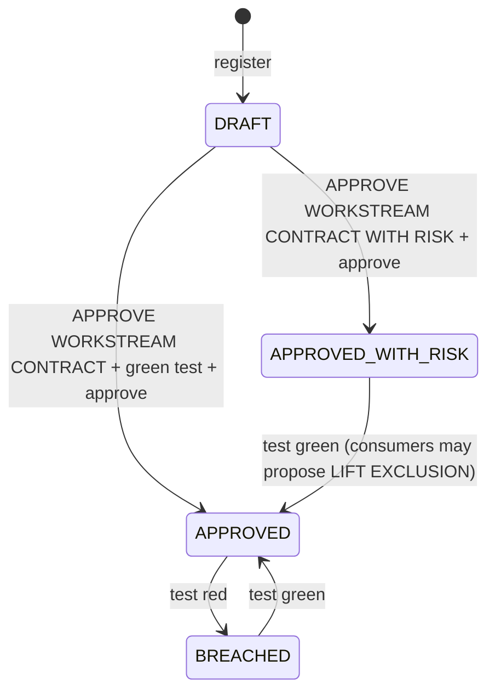

# Hub-and-spoke: contracts between workstreams (tier 3)

**Golden rule:** no consumer workstream builds against an unapproved producer contract unless
the risk is accepted in writing, and then its release claims are excluded until the contract is
verified and the exclusion is lifted by a decision.

## Layout

A **hub** is a git repository with a track root initialised as a hub; each **workstream** is its
own repository. Hub and workstreams can sit side by side (`../forecasting-hub`) or the hub can be a
directory inside a monorepo: `hub:` in a unit's `unit.yaml` is a relative or absolute path.

```
forecasting-hub/.track/
  workstream-map.md     WS-NNN, name, repo path, owner, produces, consumes
  contracts/C-NNN.md    one per contract (front matter + description)
  contract-registry.md  generated
  dependency-map.md     generated (mermaid)
  TECHNICAL_DESIGN.md   central design, versioned
  human-decisions.md    APPROVE WORKSTREAM CONTRACT ..., APPROVE INTEGRATION RELEASE
data-repo/.track/phases/01-dataset/unit.yaml      workstream: WS-001, tier: 3, hub: ../forecasting-hub, produces: [C-001]
api-repo/.track/phases/01-api/unit.yaml           workstream: WS-002, tier: 3, hub: ../forecasting-hub, consumes: [C-001]
```

## Contract lifecycle



A contract's `test_command` runs in the producer repository and must fail when the producer stops
meeting the contract (an expectation suite for data, schema conformance for an API). Run
`aidlc-contract.sh test --all` on a schedule and on every producer merge; the integration-release
pipeline runs it first.

## Commands (`<agent-dir>/hooks/_bin/aidlc-contract.sh`, skill `/contract-registry`)

| Where | Command | Effect |
| --- | --- | --- |
| hub | `init` | hub files |
| hub | `workstream WS-001 --name Data --repo ../data-repo --owner "Helen T"` | row in workstream-map.md |
| hub | `register C-001 --kind data --producer WS-001 --consumers WS-002 --schema <p> --test "<cmd>"` | DRAFT contract, maps regenerated |
| hub | `request-approval C-001` | approve-contract checkpoint (high risk) |
| hub | `approve C-001` | applies the latest accepted decision: plain needs a green test (K02), WITH RISK gives APPROVED_WITH_RISK; no decision is K01 |
| hub | `test [C-001\|--all]` | verifies, breaches or restores |
| consumer | `check` | 0 approved · 3 risk-accepted (sets `release_claims_excluded: true`) · 2 blocked |
| consumer | `propose-lift` | lift-exclusion checkpoint once every consumed contract is APPROVED (K03 otherwise) |

## Enforcement

| Point | Rule |
| --- | --- |
| Pre-write guard W09 | tier 3 consumer source writes blocked while a consumed contract is DRAFT, BREACHED or unregistered; risk-accepted contracts allowed and the unit marked excluded |
| Approval guard | `APPROVE WORKSTREAM CONTRACT[ WITH RISK]: WS-NNN - <text>` and `LIFT EXCLUSION: WS-NNN - <text>` are high-risk decisions; an accepted lift sets `release_claims_excluded: false` |
| Scorecard D5 | fails while a consumed contract is not approved or the unit's release claims are excluded |
| Consistency X02 | a real edit to an approved contract is detected; registry-maintained fields (status, approved_by_decision, last_test) and the exclusion flag are not edits |
| `api-contract-analyzer --registry C-NNN` | explains a breach against the registered schema |
| `plan-gen`, `design-review` | tier 3 plans cite the central TDES version and the contracts they build against |

## Status

Tested with a hub and two workstream repositories in `tests/aidlc-phase4.test.js`. It has not yet
run on a real second workstream; validate it on the first real consumer before relying on it.
