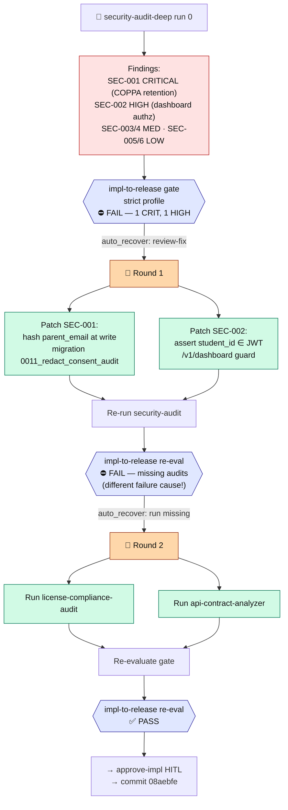
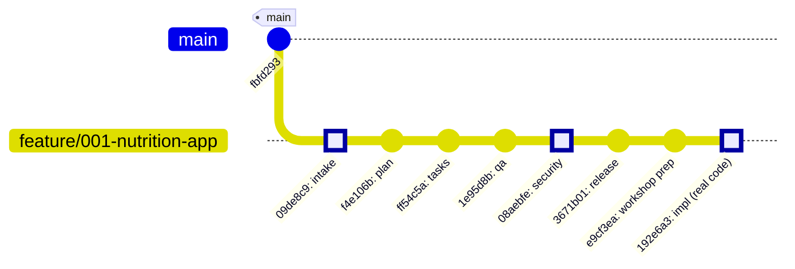

# NutriKids Roleplay — Visual Flow

*Workshop artefact. Renders on GitHub and in any Mermaid-capable viewer.*

All four diagrams describe the **same run** shown from different angles: swimlane, fix-loop zoom, commit timeline, and artefact matrix.

---

## 1. Master flow — persona → pipeline → gate → artefact → handoff

Each column is a stage. Solid arrows = flow. Dotted arrows = produces. `📌` = commit on `feature/001-nutrition-app`.

```mermaid
flowchart TB
    classDef persona fill:#fef3c7,stroke:#92400e,stroke-width:2px,color:#111
    classDef pipeline fill:#dbeafe,stroke:#1e40af,color:#111
    classDef skill fill:#ede9fe,stroke:#5b21b6,color:#111
    classDef qualgate fill:#d1fae5,stroke:#047857,color:#111
    classDef decgate fill:#fee2e2,stroke:#b91c1c,color:#111
    classDef hitlgate fill:#fce7f3,stroke:#9d174d,stroke-dasharray:5 3,color:#111
    classDef artefact fill:#f3f4f6,stroke:#374151,color:#111
    classDef commit fill:#e9d5ff,stroke:#6b21a8,color:#111,font-weight:bold
    classDef loop fill:#fed7aa,stroke:#9a3412,color:#111

    %% -------- STAGE A: PO --------
    Priya(["👤 Priya<br/>Product Owner"]):::persona
    Priya --> PipA["🔗 feature-intake<br/>pipeline"]:::pipeline
    PipA --> SkBS["balance-sheet-quick"]:::skill
    SkBS --> DG1{{"⚡ balance-sheet<br/>decision gate<br/>GO w/ conditions"}}:::decgate
    DG1 --> SkSpec["spec-gen"]:::skill
    SkSpec --> QG1{{"💎 spec-to-plan<br/>quality gate<br/>standard · PASS"}}:::qualgate
    QG1 --> HG1(("✋ approve-spec HITL<br/>APPROVE w/ conditions")):::hitlgate
    SkBS -.-> ArtBS[/"balance-sheet-quick.md"/]:::artefact
    SkSpec -.-> ArtSpec[/"spec.md"/]:::artefact
    QG1 -.-> ArtG1[/"gate-spec-to-plan.md"/]:::artefact
    HG1 -.-> ArtBrief[/"gate-briefing-intake.md"/]:::artefact
    HG1 --> C1["📌 09de8c9<br/>intake"]:::commit

    %% -------- STAGE B: Architect --------
    C1 -->|"git pull"| Arjun(["👤 Arjun<br/>Architect"]):::persona
    Arjun --> PipB["🔗 design-to-plan<br/>pipeline"]:::pipeline
    PipB --> SkPlan["plan-gen"]:::skill
    SkPlan --> SkADR["decision-log"]:::skill
    SkADR --> QG2{{"💎 plan-to-tasks<br/>quality gate<br/>standard · PASS"}}:::qualgate
    QG2 --> HG2(("✋ approve-plan HITL<br/>APPROVE")):::hitlgate
    SkPlan -.-> ArtPlan[/"plan.md"/]:::artefact
    SkADR -.-> ArtADR[/"decision-log.md"/]:::artefact
    QG2 -.-> ArtG2[/"gate-plan-to-tasks.md"/]:::artefact
    HG2 --> C2["📌 f4e106b<br/>plan"]:::commit

    %% -------- STAGE C: Dev --------
    C2 -->|"git pull"| Mahesh(["👤 Mahesh + Karan + Anita<br/>Developer"]):::persona
    Mahesh --> PipC["🔗 feature-build<br/>pipeline"]:::pipeline
    PipC --> SkTasks["task-gen"]:::skill
    SkTasks --> SkWave["wave-scheduler"]:::skill
    SkWave --> SkImpl["task-implementer<br/>(TASK-001/002/003)"]:::skill
    SkTasks -.-> ArtTasks[/"tasks.md"/]:::artefact
    SkWave -.-> ArtWave[/"wave-schedule.md"/]:::artefact
    SkImpl -.-> ArtCode[/"apps/api/<br/>• 0001_initial.py (RLS)<br/>• session.py<br/>• test_rls_isolation.py"/]:::artefact
    SkWave --> HGmid(("✋ approve-plan-stage<br/>HITL (mid-wave)<br/>APPROVE")):::hitlgate
    HGmid --> SkImpl
    SkImpl --> C3["📌 ff54c5a tasks<br/>📌 192e6a3 impl"]:::commit

    %% -------- STAGE D: QA --------
    C3 -->|"git pull"| Anita(["👤 Anita<br/>QA"]):::persona
    Anita --> PipD["🔗 release-validation<br/>pipeline"]:::pipeline
    PipD --> SkReview["spec-review"]:::skill
    SkReview --> SkTestGen["test-gen"]:::skill
    SkTestGen --> QG3{{"💎 tasks-to-impl<br/>quality gate<br/>strict · PASS"}}:::qualgate
    SkReview -.-> ArtCompl[/"spec-compliance.md"/]:::artefact
    SkTestGen -.-> ArtTestPlan[/"test-plan-rls-isolation.md"/]:::artefact
    QG3 --> C4["📌 1e95d8b<br/>qa"]:::commit

    %% -------- STAGE E: Security --------
    C4 -->|"git pull"| Vikram(["👤 Vikram<br/>Security"]):::persona
    Vikram --> SkAudit["security-audit-deep"]:::skill
    SkAudit -.-> ArtAudit[/"security-audit.md<br/>1 CRIT + 1 HIGH + 2 MED + 2 LOW"/]:::artefact
    SkAudit --> QG4a{{"💎 impl-to-release<br/>strict · FAIL"}}:::qualgate
    QG4a -->|"auto_recover"| Loop["🔁 review-fix loop<br/>(see §2)"]:::loop
    Loop -.-> ArtLoop[/"review-fix-loop.md<br/>license-audit.md<br/>api-contract.md"/]:::artefact
    Loop --> QG4b{{"💎 impl-to-release<br/>re-run · PASS"}}:::qualgate
    QG4b --> HG4(("✋ approve-impl HITL<br/>strict · APPROVE")):::hitlgate
    HG4 --> C5["📌 08aebfe<br/>security"]:::commit

    %% -------- STAGE F: DevOps --------
    C5 -->|"git pull"| Pradeep(["👤 Pradeep<br/>DevOps"]):::persona
    Pradeep --> PipF["🔗 deploy-verify<br/>pipeline"]:::pipeline
    PipF --> SkReady["release-readiness"]:::skill
    SkReady --> SkNotes["release-notes"]:::skill
    SkNotes --> SkDeploy["deploy-verify"]:::skill
    SkReady -.-> ArtReady[/"release-readiness.md"/]:::artefact
    SkNotes -.-> ArtNotes[/"release-notes.md"/]:::artefact
    SkDeploy -.-> ArtDeploy[/"deploy-verify.md"/]:::artefact
    SkDeploy --> HG5(("✋ approve-release HITL<br/>APPROVE")):::hitlgate
    HG5 --> C6["📌 3671b01<br/>release"]:::commit
    C6 --> Live["🎉 v1.0.0 LIVE<br/>2026-05-02"]
```

**Legend**

| Shape | Meaning |
|-------|---------|
| 👤 rounded tan | Persona |
| 🔗 blue pill | Pipeline |
| purple rect | Skill invoked by the pipeline |
| `⚡` red diamond | Decision gate |
| `💎` green diamond | Quality gate |
| `✋` pink circle (dashed) | Human-in-the-loop gate |
| grey document | Artefact (file committed to the branch) |
| `📌` purple | Git commit — the handoff |
| `🔁` orange | Recursive fix-loop |

---

## 2. Recursive fix-loop zoom (Stage E)

This is the workshop's hero moment — the gate failed, the loop retried, the gate failed for a *different* reason, the loop retried again, and then passed. No human escalation.

**Why this matters for the workshop:** round 2 only ran because round 1 *did not lie about success*. The gate was the source of truth, not the auditor's narrative. That's the governance story.

---

## 3. Git timeline — the handoffs are the commits

Each commit is exactly one stage's worth of artefacts. No stage ran until the previous commit landed. The branch is the contract.

---

## 4. Artefact matrix — producer, consumer, gate it feeds

| # | Artefact | Produced by | Consumed by | Feeds gate |
|---|----------|-------------|-------------|------------|
| 1 | `balance-sheet-quick.md` | Priya (balance-sheet-quick skill) | Priya | `balance-sheet` decision gate |
| 2 | `spec.md` | Priya (spec-gen skill) | Arjun, Anita | `spec-to-plan` quality gate |
| 3 | `gate-spec-to-plan.md` | validate-spec (auto) | Priya | bumps to HITL |
| 4 | `gate-briefing-intake.md` | gate-briefing skill | Priya (sign) | `approve-spec` HITL |
| 5 | `plan.md` | Arjun (plan-gen skill) | Mahesh, Anita, Vikram | `plan-to-tasks` quality gate |
| 6 | `decision-log.md` | Arjun (decision-log skill) | Mahesh (context), Vikram (audit trail) | — |
| 7 | `gate-plan-to-tasks.md` | validate-plan (auto) | Arjun | bumps to HITL |
| 8 | `tasks.md` | Mahesh (task-gen skill) | Mahesh, Anita | `tasks-to-impl` quality gate |
| 9 | `wave-schedule.md` | Mahesh (wave-scheduler skill) | Mahesh, scrum master | — |
| 10 | `apps/api/**` (real code) | Mahesh (task-implementer skill) | QA test run, Security audit | `impl-to-release` quality gate |
| 11 | `spec-compliance.md` | Anita (spec-review skill) | Mahesh (findings loop back), Vikram | `tasks-to-impl` |
| 12 | `test-plan-rls-isolation.md` | Anita (test-gen skill) | Mahesh (implement tests), Vikram | `impl-to-release` |
| 13 | `security-audit.md` | Vikram (security-audit-deep skill) | Mahesh (patch findings) | `impl-to-release` |
| 14 | `review-fix-loop.md` | review-fix skill (auto) | Vikram | re-evaluate `impl-to-release` |
| 15 | `license-audit.md` | license-compliance-audit skill | Vikram | `impl-to-release` (strict requires) |
| 16 | `api-contract.md` | api-contract-analyzer skill | Vikram | `impl-to-release` (strict requires) |
| 17 | `release-readiness.md` | Pradeep (release-readiness skill) | Pradeep | `approve-release` HITL |
| 18 | `release-notes.md` | Pradeep (release-notes skill) | School comms, parents | — |
| 19 | `deploy-verify.md` | Pradeep (deploy-verify skill) | Pradeep (promotion decision) | final |
| 20 | `run-log.md` | Pradeep (summary) | Workshop attendees | — |

**Rule:** every artefact lives in `specs/001-nutrition-app/` or `apps/api/`, both committed. No DMs, no shared drives. **The branch is the contract.**

---

## 5. Gate inventory from this run

| Stage | Gate | Type | Profile | Verdict | Fixable by auto-recover? |
|-------|------|------|---------|---------|--------------------------|
| A | `balance-sheet` | decision | — | GO w/ conditions | n/a |
| A | `spec-to-plan` | quality | standard | PASS | yes (spec-evolve) |
| A | `approve-spec` | HITL | standard | APPROVE w/ conditions | no |
| B | `plan-to-tasks` | quality | standard | PASS | yes (plan-evolve) |
| B | `approve-plan` | HITL | standard | APPROVE | no |
| C | `approve-plan-stage` | HITL | standard | APPROVE | no |
| D | `tasks-to-impl` | quality | strict | PASS | yes (task-gen re-run) |
| E | `impl-to-release` #1 | quality | strict | **FAIL** | yes (review-fix) |
| E | `impl-to-release` #2 | quality | strict | **FAIL** | yes (run missing audits) |
| E | `impl-to-release` #3 | quality | strict | PASS | — |
| E | `approve-impl` | HITL | strict | APPROVE | no |
| F | `approve-release` | HITL | strict | APPROVE | no |

**Totals:** 4 quality gate evaluations, 1 decision gate, 5 HITL gates. The `impl-to-release` gate fired 3 times in the same stage — that's the loop honestly accounting for itself.

---

*Viewable on GitHub at `https://github.com/manojkvel/sdlc_central/blob/feature/001-nutrition-app/docs/workshop/2026-04-17-nutrition-app/flow-diagram.md`.*
