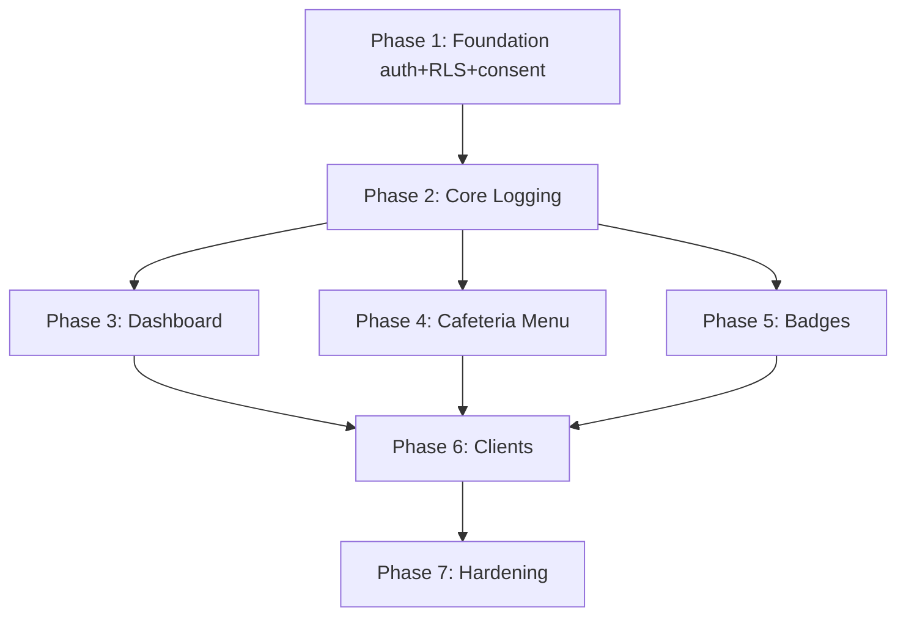

# Implementation Plan: NutriKids — School-Nutrition Tracking

> **Spec:** [001 — NutriKids](spec.md)
> **Status:** DRAFT (AI-generated via `/plan-gen`, pending Architect + Tech Lead review)
> **Created:** 2026-04-17
> **Estimated effort:** XL (6 weeks, 2 devs + 1 mobile dev, part-time QA + designer)

---

## 1. Summary

Monorepo containing a FastAPI Python backend (PostgreSQL with row-level security), a Next.js web client, and a React Native mobile app. Shared TypeScript domain types across web and mobile. Authentication via OIDC to Google Workspace for Education. Offline meal-logging implemented via a replication queue (mobile: SQLite; web: IndexedDB + service worker). Built as 7 phases; the first two (Foundation + Core logging) are prerequisites for all acceptance criteria. A feature flag `consent.mechanism` (values: `sso_verified` | `wet_signature`) allows OQ-1 to resolve either way without changing the consent DB model.

**Greenfield project note:** This plan assumes a new repo `nutrikids/` with no existing code to ground in. The `File Change Summary` therefore consists entirely of CREATE actions.

## 2. Architecture Decisions

| # | Decision | Rationale | Alternatives Considered |
|---|----------|-----------|------------------------|
| AD-1 | Monorepo (pnpm workspace + Poetry backend) containing `apps/web`, `apps/mobile`, `apps/api`, `packages/domain` (shared TS types) | Shared domain types prevent web/mobile drift; single CI pipeline; single PR surface | Polyrepo per surface (rejected — sync overhead); Turborepo (deferred — pnpm workspaces are simpler for a team of 3) |
| AD-2 | FastAPI + PostgreSQL (RDS US region) with row-level security (RLS) enforced for `students`, `meal_logs`, `parent_child_links` | COPPA/FERPA multi-tenant isolation is easier and harder-to-circumvent at DB layer than app layer; Python aligns with team's existing skills | Node.js backend (rejected — team prefers Python); Firestore (rejected — RLS equivalent is less transparent for FERPA audit) |
| AD-3 | Auth via OIDC with Google Workspace for Education; access tokens 15 min, refresh silent in SSO session; no password storage | Matches spec Security constraint; school already has GWfE tenant; zero password-reset support load | Auth0 (rejected — additional vendor); custom auth (rejected — reinvents OIDC) |
| AD-4 | Offline logging via local write queue: SQLite (mobile via expo-sqlite) + IndexedDB (web via Dexie). Logs written with client-generated UUIDs; server dedupes by (student_id, meal_slot, date, client_uuid). | Spec AC-2 mandates offline + 60s sync; client-generated UUIDs enable idempotent server insert | Pure online-only (rejected — AC-2); CRDT-based merge (rejected — overkill for append-only logs) |
| AD-5 | Cafeteria menu versions are immutable; logs reference `menu_version_id`. On new publish, a background job re-attaches open logs from the previous version's effective window (same calendar day). | Enforces spec BR-4 and Edge Case #1 | Mutable menu with audit log (rejected — harder to prove for FERPA audit) |
| AD-6 | Parental consent mechanism behind a feature flag `consent.mechanism` with two implementations: `sso_verified` (parent email + SSO link confirms) and `wet_signature` (parent uploads signed PDF + email + SSO link). Data model identical; only the verification step differs. | Resolves OQ-1 without blocking planning; flip the flag once legal decides (2026-04-19) | Wait for legal before planning (rejected — PO explicitly said plan around it); hard-code one variant (rejected — rework risk) |
| AD-7 | Age-bracket targets stored as JSON config in repo, loaded at boot, versioned with nutrition-config changes. Hot-reload on deploy. | BR-6 says targets are a function of bracket only; quarterly nurse review (OQ-3 resolution) drives config PRs | DB-stored editable by admin (deferred — no admin UI in v1) |
| AD-8 | Badges computed by a nightly Sunday-23:59 cron (UTC-aligned to school timezone) that writes to `weekly_badges`. No real-time recompute. | AC-4 is week-scoped; eventual consistency is acceptable for a retrospective view | Real-time recompute on every log (rejected — wasted compute) |
| AD-9 | Server-authoritative dates/times; client clock used only for display | Edge Case #6; avoids students fast-forwarding their clock to earn badges | Trust client (rejected — adversarial kid problem) |
| AD-10 | No third-party analytics, crash reporting, ad SDKs. First-party OpenTelemetry only, with student IDs hashed in traces. | Spec NG-5 + COPPA; analytics SDKs frequently phone home in ways that violate COPPA | Sentry / Firebase (rejected — data-leak risk) |

## 3. Acceptance Criteria Traceability

| AC | Summary | Implemented In | Tested In |
|----|---------|----------------|-----------|
| AC-1 | One-tap cafeteria log, dashboard updates in 2s | Phase 2 (logging service) + Phase 4 (cafeteria menu) + Phase 6 (mobile UI) | Phase 4 integration, Phase 6 E2E |
| AC-2 | Offline log syncs within 60s of reconnect | Phase 2 (replication queue) + Phase 6 (mobile offline) | Phase 6 E2E with airplane-mode harness |
| AC-3 | Dashboard shows 6 progress bars vs bracket targets | Phase 3 (dashboard service) + Phase 6 (UI) | Phase 3 service tests + Phase 6 snapshot tests |
| AC-4 | Rainbow Plate badge on 5/5 fruit-veg days | Phase 5 (badge engine) | Phase 5 cron test harness |
| AC-5 | Parent read-only access enforced server-side | Phase 1 (RLS) + Phase 3 (API) | Phase 1 RLS tests + Phase 3 pen-test with forged JWT |
| AC-6 | Menu publish visible in 60s, immutable versions | Phase 4 | Phase 4 integration |
| AC-7 | Under-13 requires parental consent before any collect | Phase 1 (consent gate) + Phase 6 (blocking screen) | Phase 1 unit + Phase 6 E2E |
| AC-8 | 3s TTI on Android 11 / 2GB RAM | Phase 7 (perf hardening) | Phase 7 with physical reference device |
| AC-9 | WCAG 2.1 AA | Phase 7 (a11y hardening) | Phase 7 axe-core + manual screen reader |
| AC-10 | Dashboard p95 < 400ms at 500-student scale | Phase 7 (load test) | Phase 7 k6 load test |

## 4. Implementation Phases

### Phase 1: Foundation — Auth, RLS, Consent (AC-5, AC-7; BR-1, BR-2, BR-5)

**Goal:** Users can log in via Google Workspace SSO. RLS prevents cross-student access. Under-13 accounts are blocked from collection until consent is recorded. Feature flag `consent.mechanism` toggles wet-signature vs SSO-verified.

**Traces to:** AC-5, AC-7; BR-1, BR-2, BR-5; Security + Compliance constraints

#### Tests First
| Test | Type | File | Validates |
|------|------|------|-----------|
| `test_oidc_student_login_returns_jwt_with_student_role` | integration | `apps/api/tests/integration/test_auth.py` | GWfE SSO callback creates student record, returns scoped JWT |
| `test_rls_student_cannot_read_other_student_meal_logs` | integration | `apps/api/tests/integration/test_rls.py` | Direct DB session as student A blocked from student B's rows |
| `test_rls_parent_only_sees_linked_children` | integration | same | Parent with 1 linked child cannot enumerate others |
| `test_under_13_login_without_consent_returns_consent_required` | integration | `apps/api/tests/integration/test_consent.py` | AC-7 — no logging allowed without consent |
| `test_consent_sso_verified_flag_records_consent` | unit | `apps/api/tests/unit/test_consent_service.py` | Flag `sso_verified` path |
| `test_consent_wet_signature_flag_records_consent_with_pdf` | unit | same | Flag `wet_signature` path |
| `test_consent_revocation_locks_account_and_schedules_deletion` | unit | same | BR-2 — 30-day deletion clock |

#### Changes
| Action | File | Description |
|--------|------|-------------|
| CREATE | `apps/api/pyproject.toml` | Project manifest, Python 3.12, FastAPI, SQLAlchemy 2, Alembic, authlib, pytest |
| CREATE | `apps/api/app/main.py` | FastAPI app factory, middleware, health endpoints |
| CREATE | `apps/api/app/auth/oidc.py` | Google Workspace OIDC flow; callback issues scoped JWT |
| CREATE | `apps/api/app/auth/dependencies.py` | `get_current_student`, `get_current_parent`, `get_current_staff` FastAPI deps |
| CREATE | `apps/api/app/db/base.py` | SQLAlchemy declarative base, session factory |
| CREATE | `apps/api/app/db/rls.py` | Session-scoped `SET LOCAL app.current_user_id` helper |
| CREATE | `apps/api/app/models/user.py` | `User` (id, email, role, grade, age_bracket, sso_subject) |
| CREATE | `apps/api/app/models/consent.py` | `ParentalConsent`, `ParentChildLink` |
| CREATE | `apps/api/app/services/consent_service.py` | Consent state machine + feature-flag branch |
| CREATE | `apps/api/config/feature_flags.py` | Env-backed feature-flag loader; `consent.mechanism` default `sso_verified` |
| CREATE | `apps/api/alembic/versions/0001_foundation.py` | Tables: `users`, `parental_consents`, `parent_child_links`; RLS policies |
| CREATE | `packages/domain/src/user.ts` | Shared user types |
| CREATE | `packages/domain/src/consent.ts` | Shared consent types |

#### Migration
- Migration name: `0001_foundation`
- Reversible: **YES** (create-only)
- Data impact: none (fresh schema)

---

### Phase 2: Core Logging — Meal Log + Replication Queue (AC-1, AC-2; BR-1)

**Goal:** A logged-in consented student can create a meal log. Logs have client-generated UUIDs for offline-safe inserts. Duplicates are idempotent.

**Traces to:** AC-1, AC-2; BR-1; Edge Case #1, #6

#### Tests First
| Test | Type | File | Validates |
|------|------|------|-----------|
| `test_create_meal_log_inserts_row` | unit | `apps/api/tests/unit/test_meal_log_service.py` | Basic log creation |
| `test_create_meal_log_is_idempotent_by_client_uuid` | unit | same | AC-2 — retry doesn't double-insert |
| `test_cannot_log_without_consent` | integration | `apps/api/tests/integration/test_meal_log.py` | AC-7 interlock |
| `test_meal_log_uses_server_date_not_client` | unit | `apps/api/tests/unit/test_meal_log_service.py` | Edge Case #6 |
| `test_duplicate_cafeteria_log_dedupes` | integration | `apps/api/tests/integration/test_meal_log.py` | Edge Case #1 |

#### Changes
| Action | File | Description |
|--------|------|-------------|
| CREATE | `apps/api/app/models/meal_log.py` | `MealLog` (id, student_id, meal_slot, date, items, source, menu_version_id?, client_uuid) |
| CREATE | `apps/api/app/services/meal_log_service.py` | Create, dedupe, read-by-student-day |
| CREATE | `apps/api/app/api/v1/meal_logs.py` | POST/GET endpoints (student-scoped) |
| CREATE | `apps/api/alembic/versions/0002_meal_logs.py` | `meal_logs` table + unique index on (student_id, meal_slot, date, client_uuid) + RLS policy |
| CREATE | `packages/domain/src/meal.ts` | Shared meal types |

#### New Endpoints
| Method | Path | Auth | Description |
|--------|------|------|-------------|
| POST | `/api/v1/meal-logs` | Student | Create or upsert a meal log (idempotent by client_uuid) |
| GET | `/api/v1/meal-logs?date=YYYY-MM-DD` | Student (own) / Parent (linked child) | List student's logs for a date |

---

### Phase 3: Dashboard — Intake vs Targets (AC-3; BR-6, BR-7)

**Goal:** Student can view today's totals vs targets for 6 metrics. Parent can view linked child's.

**Traces to:** AC-3, AC-10 (partial — contract only; load tested in Phase 7); BR-6, BR-7

#### Tests First
| Test | Type | File | Validates |
|------|------|------|-----------|
| `test_dashboard_aggregates_daily_totals_from_meal_logs` | unit | `apps/api/tests/unit/test_dashboard_service.py` | Correct aggregation |
| `test_dashboard_targets_match_age_bracket_config` | unit | same | BR-6 |
| `test_parent_dashboard_returns_child_data_only` | integration | `apps/api/tests/integration/test_dashboard.py` | AC-5 at dashboard surface |

#### Changes
| Action | File | Description |
|--------|------|-------------|
| CREATE | `apps/api/app/services/dashboard_service.py` | Aggregate meal logs → totals; join with bracket targets |
| CREATE | `apps/api/app/api/v1/dashboard.py` | GET endpoint |
| CREATE | `apps/api/config/nutrition_targets.json` | Per-bracket targets (10-11, 12-13, 14+) |
| CREATE | `apps/api/app/services/target_loader.py` | Config loader with hot-reload on SIGHUP |

#### New Endpoints
| Method | Path | Auth | Description |
|--------|------|------|-------------|
| GET | `/api/v1/dashboard/{student_id}?date=` | Student (own) / Parent (linked) | Daily totals + targets |
| GET | `/api/v1/dashboard/{student_id}/week?ending=` | same | Weekly view |

---

### Phase 4: Cafeteria Menu — Publish + Log-by-One-Tap (AC-1, AC-6; BR-4)

**Goal:** Staff publishes a daily menu; students one-tap log from it; menu versions are immutable.

**Traces to:** AC-1, AC-6; BR-4; Edge Case #3, #8

#### Tests First
| Test | Type | File | Validates |
|------|------|------|-----------|
| `test_publish_menu_creates_new_version` | unit | `apps/api/tests/unit/test_menu_service.py` | BR-4 |
| `test_publish_blocked_when_dish_missing_nutrition` | unit | same | Edge Case #3 |
| `test_republish_reattaches_open_logs_to_latest_version` | integration | `apps/api/tests/integration/test_menu.py` | Edge Case #1 |
| `test_retired_dish_cannot_be_used_in_new_menu` | unit | `apps/api/tests/unit/test_dish_service.py` | Edge Case #8 |

#### Changes
| Action | File | Description |
|--------|------|-------------|
| CREATE | `apps/api/app/models/dish.py` | `Dish`, `DishNutrition` |
| CREATE | `apps/api/app/models/daily_menu.py` | `DailyMenu`, `DailyMenuVersion`, `DailyMenuItem` |
| CREATE | `apps/api/app/services/menu_service.py` | Publish, version, immutability, dedup |
| CREATE | `apps/api/app/services/dish_service.py` | Dish library CRUD (staff-only) |
| CREATE | `apps/api/app/api/v1/menu.py` | POST/GET endpoints |
| CREATE | `apps/api/alembic/versions/0003_menu_dishes.py` | Tables + indexes + RLS |
| CREATE | `apps/api/scripts/seed_usda_dishes.py` | Initial dish-library seed from USDA FoodData Central (one-time) |

#### New Endpoints
| Method | Path | Auth | Description |
|--------|------|------|-------------|
| POST | `/api/v1/cafeteria/menu` | Staff | Publish today's (or any date's) menu; creates new version |
| GET | `/api/v1/cafeteria/menu?date=` | Any authenticated | Fetch latest version |
| GET | `/api/v1/cafeteria/dishes` | Staff | Dish library |

---

### Phase 5: Badges — Rainbow Plate + Steady Fuel (AC-4; BR-3)

**Goal:** Sunday 23:59 (school-tz) cron computes week's badges and writes assignments.

**Traces to:** AC-4; BR-3

#### Tests First
| Test | Type | File | Validates |
|------|------|------|-----------|
| `test_rainbow_plate_awarded_on_5_fruit_veg_days_of_5` | unit | `apps/api/tests/unit/test_badge_engine.py` | BR-3 a |
| `test_steady_fuel_awarded_on_all_3_meals_5_days` | unit | same | BR-3 b |
| `test_badges_stack_independently` | unit | same | BR-3 "rules stack" |
| `test_cron_idempotent_if_run_twice_for_same_week` | integration | `apps/api/tests/integration/test_badge_cron.py` | Safety |

#### Changes
| Action | File | Description |
|--------|------|-------------|
| CREATE | `apps/api/app/services/badge_engine.py` | Rule evaluator |
| CREATE | `apps/api/app/models/weekly_badge.py` | `WeeklyBadge` |
| CREATE | `apps/api/app/jobs/weekly_badges.py` | Cron target (invoked by `apscheduler`) |
| CREATE | `apps/api/alembic/versions/0004_weekly_badges.py` | Table |

---

### Phase 6: Clients — Mobile + Web UX (AC-1, AC-2, AC-3, AC-5, AC-7)

**Goal:** React Native app for students (iOS+Android); Next.js web for parents + cafeteria staff. Mobile supports offline logging.

**Traces to:** AC-1, AC-2, AC-3, AC-5, AC-7; Edge Case #4

#### Tests First
| Test | Type | File | Validates |
|------|------|------|-----------|
| `test_cafeteria_card_renders_menu_with_one_tap_log` | component | `apps/mobile/src/screens/Home/__tests__/` | UX shape |
| `test_offline_log_queued_in_sqlite` | unit | `apps/mobile/src/sync/__tests__/queue.test.ts` | AC-2 queue |
| `test_reconnect_syncs_within_60s` | integration | `apps/mobile/src/sync/__tests__/sync.test.ts` | AC-2 timing |
| `test_consent_blocking_screen_prevents_logging` | component | `apps/mobile/src/screens/Consent/__tests__/` | Edge Case #4 |
| `test_parent_dashboard_read_only` | component | `apps/web/src/pages/parent/__tests__/` | AC-5 UI |

#### Changes (mobile)
| Action | File | Description |
|--------|------|-------------|
| CREATE | `apps/mobile/package.json` | Expo RN, expo-sqlite, Dexie-analog via WatermelonDB |
| CREATE | `apps/mobile/src/screens/Home/HomeScreen.tsx` | Cafeteria card + quick-log |
| CREATE | `apps/mobile/src/screens/Dashboard/DashboardScreen.tsx` | 6 progress bars |
| CREATE | `apps/mobile/src/screens/Consent/ConsentRequiredScreen.tsx` | Blocking screen + email parent CTA |
| CREATE | `apps/mobile/src/sync/queue.ts` | Local write queue with retry + client_uuid |
| CREATE | `apps/mobile/src/sync/reconciler.ts` | Reconcile local SQLite vs server response |
| CREATE | `apps/mobile/src/api/client.ts` | Typed API client (uses `packages/domain` types) |

#### Changes (web)
| Action | File | Description |
|--------|------|-------------|
| CREATE | `apps/web/package.json` | Next.js 15, React 19, next-auth (OIDC) |
| CREATE | `apps/web/app/parent/page.tsx` | Parent "My Children" landing |
| CREATE | `apps/web/app/parent/[studentId]/page.tsx` | Read-only weekly dashboard |
| CREATE | `apps/web/app/cafeteria/menu/page.tsx` | Menu publisher |
| CREATE | `apps/web/app/(auth)/callback/route.ts` | SSO callback → issue session |

---

### Phase 7: Hardening — Perf, a11y, COPPA audit (AC-8, AC-9, AC-10)

**Goal:** Close AC-8/9/10, run a dry-run COPPA/FERPA audit, bake deletion job.

**Traces to:** AC-8, AC-9, AC-10; Security + Compliance constraints

#### Tests First
| Test | Type | File | Validates |
|------|------|------|-----------|
| `perf_cold_start_tti_on_ref_android_device` | E2E (Maestro) | `apps/mobile/e2e/perf_cold_start.yml` | AC-8 |
| `a11y_axe_core_all_screens` | E2E | `apps/web/e2e/a11y.spec.ts` + `apps/mobile/e2e/a11y.yml` | AC-9 automated portion |
| `load_500_students_p95_under_400ms` | k6 | `tests/load/dashboard.js` | AC-10 |
| `coppa_deletion_job_removes_all_pii_within_30_days` | integration | `apps/api/tests/integration/test_retention.py` | BR-2 |

#### Changes
| Action | File | Description |
|--------|------|-------------|
| CREATE | `apps/api/app/jobs/coppa_deletion.py` | Daily cron; hard-delete accounts past consent-revocation + 30d |
| CREATE | `apps/api/app/jobs/anonymise_graduates.py` | Annual cron per BR retention |
| CREATE | `tests/load/dashboard.js` | k6 script |
| CREATE | `apps/web/e2e/a11y.spec.ts` | Playwright + axe-core |
| CREATE | `apps/mobile/e2e/perf_cold_start.yml` | Maestro flow |
| CREATE | `docs/coppa-audit-checklist.md` | Internal audit checklist |

---

## 5. File Change Summary

| File | Action | Phase | Lines (est.) |
|------|--------|-------|-------------|
| (backend API, ~40 files) | CREATE | 1–5, 7 | ~4,500 |
| (mobile app, ~35 files) | CREATE | 6–7 | ~3,200 |
| (web app, ~25 files) | CREATE | 6–7 | ~2,000 |
| (shared `packages/domain`, ~8 files) | CREATE | 1–6 | ~400 |
| (test suites, ~30 files) | CREATE | all | ~3,800 |
| (infra, Dockerfile, Terraform, CI, ~12 files) | CREATE | 1, 7 | ~900 |

**Total files:** ~150 (all new)
**Estimated total lines:** ~14,800
**T-shirt:** XL

## 6. Risks & Mitigations

| Risk | Severity | Likelihood | Mitigation |
|------|----------|-----------|------------|
| OQ-1 (COPPA consent mechanism) flips late and invalidates UX flow | **HIGH** | MED | AD-6: feature-flag both implementations; DB model invariant |
| RLS policy bug allows cross-student read | **CRITICAL** | LOW | Phase 1 adversarial tests with forged JWT; pen-test in Phase 7 |
| Offline sync race (log written twice across reconnect) | HIGH | MED | Client UUID + server idempotency (AD-4, Phase 2 test) |
| 3-year-old Android device fails 3s TTI target | HIGH | MED | Phase 7 on physical reference device weekly from Phase 2 onward |
| USDA FoodData seed mismatches typical school-cafeteria dishes | MED | HIGH | Nurse reviews seed; manual corrections allowed pre-launch |
| Parent email invites flagged as spam | MED | MED | Use school's own SMTP relay; warm IP; opt-in from the PO's intake comms plan |
| COPPA 30-day deletion misses a table | **CRITICAL** | LOW | Phase 7 deletion-audit test iterates every table referencing a user_id |
| Badge cron misses a week (server down Sunday night) | LOW | LOW | Idempotent re-run, retention of logs makes back-fill trivial |
| SSO tenant misconfigured → parents can log in as students | HIGH | LOW | Role check server-side on every request; JWT role claim validated vs DB role |

## 7. Rollback Plan

- **Feature flag kill switch:** `app.enabled = false` in the API config disables all `/api/v1` traffic; mobile and web show maintenance screen.
- **Database rollback:** Each Alembic migration is reversible. Rollback order: 0004 → 0003 → 0002 → 0001.
- **COPPA-protected data:** If rolling back post-launch with live student data, **do not drop tables**; preserve data for legally-mandated retention. Coordinate rollback with school legal.
- **Client rollback:** Mobile — revert App Store / Play Store build via prior-version submission (not force-update). Web — deploy previous container image; CDN cache flush.

## 8. Dependencies & Ordering

**External dependencies that must be ready before Phase 1:**
- Google Workspace for Education SSO app registered — owner: school IT (ETA: 2026-04-19)
- RDS Postgres instance in us-east-1 provisioned — owner: DevOps (ETA: 2026-04-20)
- SendGrid (or equivalent) transactional-email account + warmed IP — owner: DevOps (ETA: 2026-04-21)
- Legal decision on OQ-1 consent mechanism — owner: school legal (ETA: 2026-04-19) — **blocks Phase 1 flag default only, not Phase 1 kickoff**

---

> **Next step:** When this plan is APPROVED by the Architect and Tech Lead at the HITL gate, run `/task-gen docs/workshop/2026-04-17-nutrition-app/specs/001-nutrition-app/plan.md` to break it into atomic tasks.
