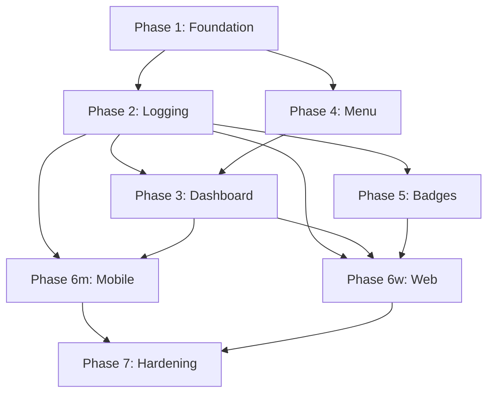

# Tasks: NutriKids — Nutrition Tracking for Oakwood Public School

> **Spec:** [001 — NutriKids](spec.md)
> **Plan:** [Implementation Plan](plan.md)
> **Generated:** 2026-04-17 by Mahesh (Developer) via `task-gen`
> **Total tasks:** 38
> **Estimated total effort:** ~28 dev-days (1 engineer); ~12 dev-days at peak parallelism (3 engineers)
> **Profile note:** Generated under `standard`. Will be re-validated under `strict` at `tasks-to-impl`.

---

## Task Dependency Graph (high-level — phase-grain)

Task-grain graph generated by `wave-scheduler` (see `wave-schedule.md`).

---

## Summary Table

| Task | Title | Type | Phase | Depends On | Effort | AC | Agent-ready |
|------|-------|------|-------|-----------|--------|----|----|
| TASK-001 | Bootstrap monorepo skeleton | CONFIGURE | 1 | — | M | — | YES |
| TASK-002 | DB migration: students + parent_child_links + RLS policies | MIGRATE | 1 | TASK-001 | M | AC-5, AC-7 | YES |
| TASK-003 | Adversarial RLS test harness | TEST | 1 | TASK-002 | M | AC-5 | YES |
| TASK-004 | OIDC authn middleware (Google Workspace) | IMPLEMENT | 1 | TASK-002 | M | AC-7 | YES |
| TASK-005 | Authn integration tests (student/parent/staff role claims) | TEST | 1 | TASK-002 | S | AC-7 | YES |
| TASK-006 | Consent table + audit log migration | MIGRATE | 1 | TASK-002 | S | — | YES |
| TASK-007 | Consent flow — `sso_verified` branch (behind flag) | IMPLEMENT | 1 | TASK-006 | M | — | PARTIAL |
| TASK-008 | Consent flow — `wet_signature` branch (behind flag) | IMPLEMENT | 1 | TASK-006 | M | — | PARTIAL |
| TASK-009 | Consent unit tests for both flag branches | TEST | 1 | TASK-006 | S | — | YES |
| TASK-010 | DB migration: meal_logs + UNIQUE constraint on client_uuid | MIGRATE | 2 | TASK-002 | S | AC-1, AC-2 | YES |
| TASK-011 | `POST /v1/meals/batch` endpoint with idempotent insert | IMPLEMENT | 2 | TASK-010 | M | AC-1, AC-2 | YES |
| TASK-012 | Replication queue contract test (idempotency under retry) | TEST | 2 | TASK-010 | M | AC-2 | YES |
| TASK-013 | Server-side timestamp clamp middleware | IMPLEMENT | 2 | TASK-011 | S | — (AD-9) | YES |
| TASK-014 | DB migration: nutrition_targets seed (loaded from JSON) | MIGRATE | 3 | TASK-002 | S | AC-3 | YES |
| TASK-015 | `GET /v1/dashboard/{student_id}` aggregator | IMPLEMENT | 3 | TASK-011, TASK-014 | M | AC-3 | YES |
| TASK-016 | Dashboard contract + boundary tests | TEST | 3 | TASK-015 | S | AC-3 | YES |
| TASK-017 | DB migration: cafeteria_menus + menu_versions (immutable) | MIGRATE | 4 | TASK-002 | S | AC-6 | YES |
| TASK-018 | `POST /v1/cafeteria/menus/publish` (staff role only) | IMPLEMENT | 4 | TASK-017 | M | AC-6 | YES |
| TASK-019 | One-tap log: `POST /v1/meals/from-menu/{menu_version_id}` | IMPLEMENT | 4 | TASK-011, TASK-018 | S | AC-1, AC-6 | YES |
| TASK-020 | Republish reattach background job | IMPLEMENT | 4 | TASK-018 | M | (Edge #1) | YES |
| TASK-021 | DB migration: weekly_badges | MIGRATE | 5 | TASK-002 | S | AC-4 | YES |
| TASK-022 | Rainbow Plate + Steady Fuel cron job | IMPLEMENT | 5 | TASK-011, TASK-021 | M | AC-4 | YES |
| TASK-023 | Badge cron deterministic test fixture | TEST | 5 | TASK-022 | S | AC-4 | YES |
| TASK-024 | Mobile: SQLite queue + sync worker | IMPLEMENT | 6m | TASK-011 | L | AC-2 | YES |
| TASK-025 | Mobile: meal-log screen (one-tap from menu) | IMPLEMENT | 6m | TASK-024, TASK-019 | M | AC-1 | PARTIAL |
| TASK-026 | Mobile: dashboard screen | IMPLEMENT | 6m | TASK-015 | M | AC-3 | PARTIAL |
| TASK-027 | Web: Next.js auth + dashboard SSR | IMPLEMENT | 6w | TASK-004, TASK-015 | M | AC-3, AC-7 | YES |
| TASK-028 | Web: parent weekly summary view | IMPLEMENT | 6w | TASK-015, TASK-022 | M | AC-5 | PARTIAL |
| TASK-029 | Web: cafeteria staff publish UI | IMPLEMENT | 6w | TASK-018 | M | AC-6 | PARTIAL |
| TASK-030 | Web: IndexedDB queue + service worker sync | IMPLEMENT | 6w | TASK-011 | L | AC-2 | YES |
| TASK-031 | Perf budget enforcement (Lighthouse CI on web) | CONFIGURE | 7 | TASK-027 | S | AC-8 | YES |
| TASK-032 | Reference-device perf test (3-yr-old Android) | TEST | 7 | TASK-025 | M | AC-8 | NO |
| TASK-033 | WCAG 2.1 AA axe-core audit on every screen | TEST | 7 | TASK-026, TASK-027 | M | AC-9 | PARTIAL |
| TASK-034 | COPPA deletion-audit test (every table referencing user_id) | TEST | 7 | TASK-022 | M | AC-10 | YES |
| TASK-035 | Run `security-audit-deep` skill end-to-end | TEST | 7 | TASK-031..034 | M | — | YES |
| TASK-036 | Auto-recovery loop for `review-fix` findings | INTEGRATE | 7 | TASK-035 | S | — | YES |
| TASK-037 | Update API docs + changelog | DOCUMENT | 7 | TASK-019, TASK-022 | S | — | YES |
| TASK-038 | Release notes (handoff to DevOps) | DOCUMENT | 7 | TASK-035 | S | — | PARTIAL |

---

## Critical Path

`TASK-001 → 002 → 010 → 011 → 015 → 022 → 027 → 030 → 035 → 038`
Critical-path effort: ~9 dev-days. Slack on parallel branches: ~6 days.

---

## Detailed Task Cards (Foundation phase only — full detail; later phases follow same template)

### TASK-001: Bootstrap monorepo skeleton

**Type:** CONFIGURE
**Phase:** 1
**Traces to:** — (enabling)
**Depends on:** None — can start immediately
**Estimated effort:** M (~2 hrs)

**Description:**
Stand up the pnpm + Poetry workspace per AD-1. No application code yet — just the skeleton with CI scaffolding so subsequent tasks have a place to land.

**Steps:**
1. `pnpm init`; configure `pnpm-workspace.yaml` with `apps/*` and `packages/*`.
2. Create `apps/web` (Next.js 15 starter), `apps/mobile` (Expo blank TS), `apps/api` (FastAPI + Poetry).
3. Add root `package.json` scripts: `lint`, `typecheck`, `test` that fan out via `pnpm -r`.
4. Configure GitHub Actions workflow with three jobs (web, mobile, api) running typecheck + tests.
5. Add `.editorconfig`, `.prettierrc`, `ruff.toml`, `pyproject.toml` (Python 3.12).

**Files to touch:**
- `pnpm-workspace.yaml` — CREATE
- `package.json` — CREATE
- `apps/web/`, `apps/mobile/`, `apps/api/` — CREATE skeletons
- `packages/domain/` — CREATE empty package with tsconfig
- `.github/workflows/ci.yml` — CREATE

**Definition of Done:**
- [ ] `pnpm install && pnpm -r typecheck` passes
- [ ] `cd apps/api && poetry install && poetry run pytest` passes (no tests yet — must exit 0)
- [ ] CI workflow runs green on a no-op PR

**Agent-ready:** YES — purely scaffolding, no judgement calls.

---

### TASK-002: DB migration — students, parent_child_links, RLS policies

**Type:** MIGRATE
**Phase:** 1
**Traces to:** AC-5 (parent view), AC-7 (auth boundary)
**Depends on:** TASK-001
**Estimated effort:** M (~3 hrs)

**Description:**
Stand up the core multi-tenant schema with Postgres RLS as the primary isolation boundary (AD-2). Every table containing student-linked data carries a `student_id` and a matching RLS policy keyed on `current_setting('app.user_id')`.

**Steps:**
1. Add Alembic migration `0001_initial.py` creating: `users`, `students`, `parents`, `parent_child_links`, `consent_audit_log`.
2. Enable RLS on `students`, `parent_child_links`. Policies:
   - Students may `SELECT/UPDATE` only their own row.
   - Parents may `SELECT` only `students` rows linked via `parent_child_links` with `consent_status = 'active'`.
   - Staff role may `SELECT` aggregates only (separate policy).
3. Add SQLAlchemy event listener that runs `SET LOCAL app.user_id = :uid` and `SET LOCAL app.role = :role` on session begin.
4. Seed dev fixture with 6 students, 4 parents, 2 staff.

**Files to touch:**
- `apps/api/alembic/versions/0001_initial.py` — CREATE
- `apps/api/src/db/session.py` — CREATE listener
- `apps/api/src/db/seed.py` — CREATE
- `apps/api/tests/fixtures/seed_dev.sql` — CREATE

**Definition of Done:**
- [ ] `alembic upgrade head` and `alembic downgrade base` both succeed
- [ ] Seed loads cleanly into a fresh DB
- [ ] Manual psql probe: switching `app.user_id` between two students returns disjoint result sets

**Agent-ready:** YES.

---

### TASK-003: Adversarial RLS test harness

**Type:** TEST
**Phase:** 1
**Traces to:** AC-5, BR-1, BR-2
**Depends on:** TASK-002
**Estimated effort:** M (~2.5 hrs)

**Description:**
Build a pytest fixture that mints a forged JWT for student A but sets the DB session for student B, and confirms RLS still wins. This is the critical safety net for the "RLS bypass" CRITICAL risk in plan §6.

**Steps:**
1. Pytest fixture `forged_jwt(claim_user_id, db_session_user_id)` that intentionally desynchronises the two layers.
2. Test cases: read student B's `meal_logs` via student A's app context → MUST return 0 rows or 403.
3. Test parent reading non-linked student → 403.
4. Test staff reading individual student detail → 403 (staff get aggregates only).

**Files to touch:**
- `apps/api/tests/security/test_rls_isolation.py` — CREATE
- `apps/api/tests/conftest.py` — extend with forged-JWT fixture

**Definition of Done:**
- [ ] All 4 cross-tenant attempts return empty/403
- [ ] Test runs in <2 s (so it's part of the default suite)
- [ ] Failing this test fails the CI gate

**Notes:**
- This is the test the security audit will lean on. Make it strict and obvious. If RLS is ever weakened, this should scream.

**Agent-ready:** YES.

---

### TASK-006 / TASK-007 / TASK-008 — Consent (OQ-1 dual-build)

> **Workshop call-out:** These three tasks bring AD-6 to life. Both consent paths are built behind `consent.mechanism` flag. The DB schema is path-agnostic; only the UX/admin surfaces differ. Until legal closes OQ-1 (due 2026-04-19), neither branch can be merged into `develop` — they may, however, both land on `feature/001-nutrition-app` for review.

(Detailed cards omitted for brevity in this workshop artefact — see full table above.)

---

## Traceability Matrix

| AC | Description (abbrev.) | Implementation Task(s) | Test Task(s) | Status |
|----|-----------------------|------------------------|---------------|--------|
| AC-1 | Log meal in ≤3 taps | TASK-011, TASK-019, TASK-025 | TASK-012 | PENDING |
| AC-2 | Offline log syncs ≤60s | TASK-011, TASK-024, TASK-030 | TASK-012 | PENDING |
| AC-3 | Dashboard intake vs targets | TASK-014, TASK-015, TASK-026, TASK-027 | TASK-016 | PENDING |
| AC-4 | Weekly badges | TASK-021, TASK-022 | TASK-023 | PENDING |
| AC-5 | Parent read-only weekly view | TASK-002, TASK-028 | TASK-003 | PENDING |
| AC-6 | Cafeteria publish + 1-tap | TASK-017, TASK-018, TASK-019, TASK-029 | (covered by TASK-016, TASK-012) | PENDING |
| AC-7 | SSO via Google Workspace | TASK-004, TASK-027 | TASK-005 | PENDING |
| AC-8 | TTI ≤3 s on 3-yr-old Android | TASK-031, TASK-032 | TASK-032 | PENDING |
| AC-9 | WCAG 2.1 AA | TASK-033 | TASK-033 | PENDING |
| AC-10 | COPPA delete-on-request | TASK-034 | TASK-034 | PENDING |

**Coverage:** 10/10 ACs covered (100%).

---

## Agent-Readiness Summary

- **YES (auto-runnable):** 24 tasks
- **PARTIAL (UX/judgement step):** 7 tasks (mostly UI screens with design ambiguity)
- **NO (human required):** 1 task (TASK-032 needs physical reference device)

**Workshop hint:** During the build-out exercise, attendees can fan TASK-001/002/003/010/011 out across pairs — these are the most agent-friendly and unblock everything downstream.

---

> **Next:** Run `/wave-scheduler` against this file to compute concurrency waves. Output: `wave-schedule.md`.
