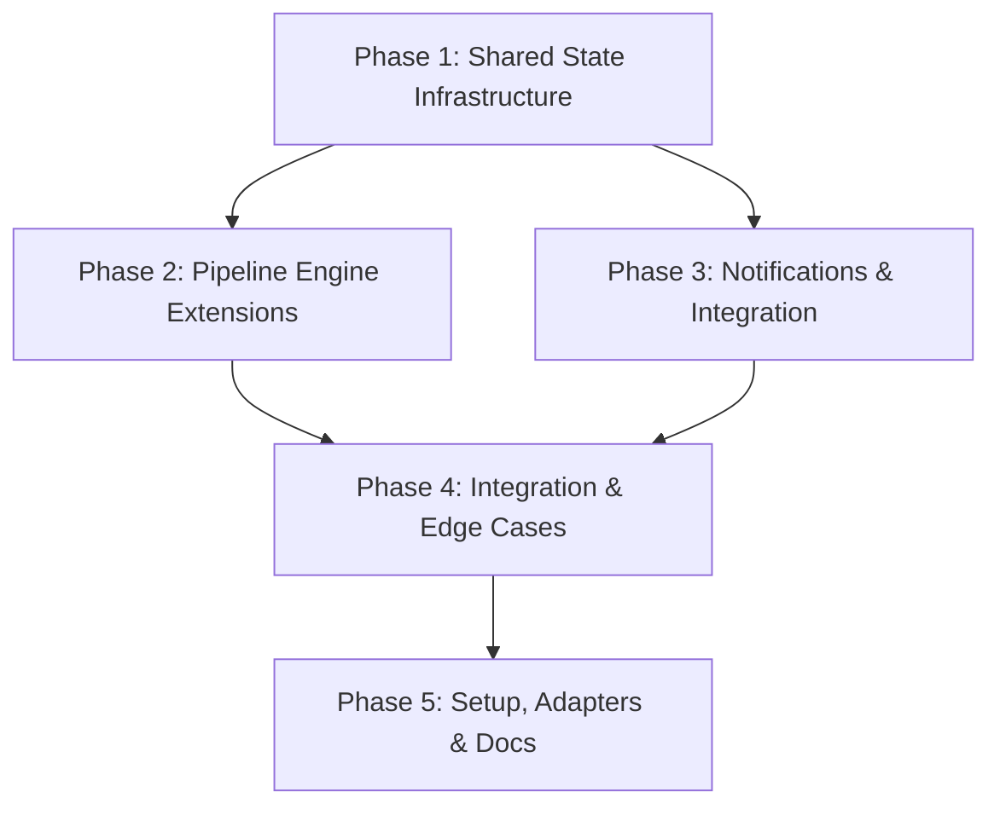

# Implementation Plan: SDLC Central Operational Layer

> **Spec:** [001 - Shared State, Notifications, Metrics, Pre-Flight, Emergency Bypass, CI/CD Hooks](spec.md)
> **Status:** DRAFT
> **Created:** 2026-03-01
> **Estimated effort:** XL

---

## 1. Summary

This plan implements six operational capabilities that transform SDLC Central from a single-agent framework into a team-ready platform. The work is organized into five phases following a foundation-first strategy: shared state infrastructure → pipeline engine extensions → external integrations → edge-case hardening → documentation and setup. Every change targets the agent-agnostic core (pipeline engine, YAML schema, `.sdlc/` directory) so that all nine adapters benefit without per-adapter work.

---

## 2. Architecture Decisions

| # | Decision | Rationale | Alternatives Considered |
|---|----------|-----------|------------------------|
| AD-1 | All new runtime state goes under `.sdlc/` (never agent-specific dirs) | Enables cross-agent pipeline resume per BR-1 and AC-8. The existing runner uses `.claude/pipelines/` which is agent-specific. | Keep `.claude/` — rejected because it breaks cross-agent resume |
| AD-2 | Pipeline runner remains a single PIPELINE-RUNNER.md skill (extended, not replaced) | The runner is already installed in all 9 adapters. Replacing it would require a migration for every user. | Create a separate "runner-v2" skill — rejected to avoid install fragmentation |
| AD-3 | Notifications use shell `curl` to POST adaptive card JSON to Power Automate | Zero new dependencies. Every system with bash 4+ has curl. Keeps the "no new external services" constraint from the spec. | Node.js HTTP client — rejected because the framework is shell-based; Python requests — rejected for same reason |
| AD-4 | Metrics and events use append-only JSONL files in `.sdlc/` | JSONL is streamable, grep-friendly, and works with the existing report-trends skill. No database needed. | SQLite — rejected (new dependency, not grep-friendly); CSV — rejected (quoting issues) |
| AD-5 | Pre-flight checks are defined inline in pipeline YAML under a `preflight:` key | Keeps each pipeline self-contained per spec OQ-4 resolution. No indirection. | Separate `preflight-checks.yaml` — deferred to V2 per spec |
| AD-6 | File locking uses atomic write-to-temp-then-rename pattern | Works on all filesystems, no external lock manager needed. Handles Edge Case #2 (concurrent resume). | `flock` — rejected because macOS ships without `flock` by default |
| AD-7 | Emergency mode is a flag on the runner, not a separate pipeline | Avoids duplicating pipeline definitions. All 22 pipelines get emergency capability for free. | Separate emergency pipelines — rejected (22 duplicates to maintain) |
| AD-8 | Shared transforms get a new `transform_state_paths` function | Adapters that install the runner need state path references updated. Centralizing this in `_shared/transform.sh` keeps it DRY. | Per-adapter path rewriting — rejected (9x duplication) |

---

## 3. Acceptance Criteria Traceability

| AC | Description | Implemented In | Tested In |
|----|-------------|----------------|-----------|
| AC-1 | Cross-agent pipeline resume | Phase 1, Phase 2 | Phase 1 (tests), Phase 4 (E2E) |
| AC-2 | Teams adaptive card notification on HITL gate | Phase 3 | Phase 3 (tests), Phase 4 (E2E) |
| AC-3 | Approval recorded in state file | Phase 2, Phase 3 | Phase 3 (tests) |
| AC-4 | Metrics consumable by report-trends | Phase 2 | Phase 2 (tests) |
| AC-5 | Pre-flight check blocks on missing tool | Phase 2 | Phase 2 (tests) |
| AC-6 | Emergency bypass with mandatory postmortem | Phase 2 | Phase 2 (tests), Phase 4 (E2E) |
| AC-7 | JSONL CI/CD event emitted per step | Phase 2 | Phase 2 (tests) |
| AC-8 | State file contains no agent-specific paths | Phase 1 | Phase 1 (tests), Phase 4 (E2E) |
| AC-9 | Postmortem cannot be dismissed without output | Phase 2 | Phase 4 (E2E) |
| AC-10 | Notification failure is non-fatal | Phase 3 | Phase 3 (tests) |

---

## 4. Implementation Phases

### Phase 1: Shared State Infrastructure

**Goal:** Create the `.sdlc/` directory structure, state file schema, config file templates, and the path-migration logic that makes state agent-agnostic.
**Traces to:** AC-1, AC-8, BR-1, BR-7

#### Tests First
| Test | Type | File | Validates |
|------|------|------|-----------|
| state_schema_valid | unit | `tests/state/test_state_schema.sh` | State JSON matches schema (all required fields present, no agent-specific paths) |
| state_no_agent_paths | unit | `tests/state/test_state_schema.sh` | Regex scan confirms no `.claude/`, `.cursor/`, `.github/` paths in state output |
| config_defaults_valid | unit | `tests/state/test_config_defaults.sh` | Default `pipeline-config.json` and `notifications.json` parse as valid JSON |
| lock_concurrent_write | unit | `tests/state/test_file_locking.sh` | Two parallel writes: first wins, second gets lock error |
| state_forward_compat | unit | `tests/state/test_state_schema.sh` | Unknown fields in state JSON are preserved after read-modify-write cycle |

#### Changes
| Action | File | Description |
|--------|------|-------------|
| CREATE | `config/pipeline-config.json` | Default pipeline config template (metrics, cicd_hooks, concurrency, emergency, notifications) per Appendix A.6 |
| CREATE | `config/notifications.json.example` | Example Teams notification config per Appendix A.2 (actual file is user-provisioned, not committed) |
| CREATE | `templates/.sdlc/pipeline-state/.gitkeep` | Directory structure template for installer to copy |
| CREATE | `templates/.sdlc/metrics/.gitkeep` | Directory structure template |
| CREATE | `templates/.sdlc/events/.gitkeep` | Directory structure template |
| CREATE | `templates/.sdlc/config/.gitkeep` | Directory structure template |
| MODIFY | `adapters/_shared/transform.sh` | Add `transform_state_paths()` function that rewrites `.claude/pipelines/pipeline-state-` → `.sdlc/pipeline-state/` and `.claude/config/` → `.sdlc/config/` across all agents |
| CREATE | `tests/state/test_state_schema.sh` | Bash test suite for state file schema validation |
| CREATE | `tests/state/test_config_defaults.sh` | Bash test suite for config file defaults |
| CREATE | `tests/state/test_file_locking.sh` | Bash test for atomic write lock behavior |

---

### Phase 2: Pipeline Engine Extensions

**Goal:** Extend the pipeline runner with pre-flight checks, emergency bypass, metrics logging, CI/CD event emission, state file V2 writes, and concurrency control.
**Traces to:** AC-1, AC-3, AC-4, AC-5, AC-6, AC-7, AC-9, BR-2, BR-3, BR-4, BR-6, BR-7

#### Tests First
| Test | Type | File | Validates |
|------|------|------|-----------|
| preflight_pass | unit | `tests/engine/test_preflight.sh` | All checks pass → pipeline starts |
| preflight_fail_required | unit | `tests/engine/test_preflight.sh` | Required check fails → pipeline blocked with clear error |
| preflight_fail_optional | unit | `tests/engine/test_preflight.sh` | Optional check fails → warning displayed, pipeline continues |
| preflight_missing_section | unit | `tests/engine/test_preflight.sh` | No `preflight:` in YAML → phase skipped silently |
| emergency_bypass_gates | unit | `tests/engine/test_emergency.sh` | `--emergency "reason"` skips all gates, records mode in state |
| emergency_requires_reason | unit | `tests/engine/test_emergency.sh` | `--emergency` without reason string → error (BR-2) |
| emergency_queues_postmortem | unit | `tests/engine/test_emergency.sh` | On emergency completion, postmortem follow-up is queued |
| emergency_no_postmortem_skill | unit | `tests/engine/test_emergency.sh` | Postmortem skill missing → warning (Edge Case #4) |
| metrics_append_only | unit | `tests/engine/test_metrics.sh` | After 3 steps, JSONL has 3 lines with correct schema |
| metrics_rotation | unit | `tests/engine/test_metrics.sh` | File > 10MB → rotated with date suffix (Edge Case #5) |
| cicd_events_emitted | unit | `tests/engine/test_cicd_events.sh` | Step completion emits event; gate failure emits event |
| cicd_events_opt_in | unit | `tests/engine/test_cicd_events.sh` | `cicd_hooks: false` → no events file written (BR-6) |
| cicd_events_recreated | unit | `tests/engine/test_cicd_events.sh` | Events file deleted by user → recreated on next event (Edge Case #8) |
| state_v2_written | integration | `tests/engine/test_state_v2.sh` | After step completion, state file matches V2 schema with `schema_version`, `started_by`, `mode` fields |
| concurrency_limit | unit | `tests/engine/test_concurrency.sh` | Running 6th pipeline when limit is 5 → rejected with error (BR-7) |
| corrupt_state_recovery | unit | `tests/engine/test_state_v2.sh` | Invalid JSON in state file → clear error message (Edge Case #1) |
| resume_from_state | integration | `tests/engine/test_state_v2.sh` | Pipeline with 3/5 steps done → resumes from step 4 |
| git_auto_stage | integration | `tests/engine/test_state_v2.sh` | After step completion, `.sdlc/pipeline-state/` files are staged (OQ-3 resolution) |

#### Changes
| Action | File | Description |
|--------|------|-------------|
| MODIFY | `pipelines/_engine/PIPELINE-RUNNER.md` | Major extension: add Phase 0 (pre-flight), emergency mode, V2 state writes, metrics logging, CI/CD event emission, concurrency checking, git auto-stage. Update Phase 1 (state path from `.claude/` to `.sdlc/`), Phase 2 (gate bypass logic for emergency), Phase 3 (V2 schema, lock file pattern) |
| MODIFY | `pipelines/_engine/PROGRESS-TEMPLATE.md` | Add `mode` field (normal/emergency), pre-flight results section, and metrics summary |
| MODIFY | `config/gate-config.json` | Add `emergency_override` key per profile documenting which gates can be bypassed in emergency mode (all in minimal/standard, HITL-only preserved in strict) |
| CREATE | `tests/engine/test_preflight.sh` | Pre-flight check test suite |
| CREATE | `tests/engine/test_emergency.sh` | Emergency bypass test suite |
| CREATE | `tests/engine/test_metrics.sh` | Metrics logging test suite |
| CREATE | `tests/engine/test_cicd_events.sh` | CI/CD event emission test suite |
| CREATE | `tests/engine/test_state_v2.sh` | V2 state schema + resume test suite |
| CREATE | `tests/engine/test_concurrency.sh` | Concurrency control test suite |

---

### Phase 3: Notifications & External Integration

**Goal:** Implement MS Teams notification delivery via Power Automate Workflows, approval recording, and graceful failure handling.
**Traces to:** AC-2, AC-3, AC-10, BR-5

#### Tests First
| Test | Type | File | Validates |
|------|------|------|-----------|
| notification_sent | unit | `tests/notifications/test_teams_notify.sh` | Valid webhook URL → curl POST returns 2xx, adaptive card payload matches schema |
| notification_timeout | unit | `tests/notifications/test_teams_notify.sh` | Webhook times out after 5s → warning logged, pipeline continues (BR-5) |
| notification_429_retry | unit | `tests/notifications/test_teams_notify.sh` | HTTP 429 → retry once after 2s → still 429 → warning, continue (Edge Case #3) |
| notification_missing_config | unit | `tests/notifications/test_teams_notify.sh` | No `notifications.json` → warning displayed, gate still fires (AC-10) |
| notification_invalid_url | unit | `tests/notifications/test_teams_notify.sh` | Malformed URL → warning, gate still fires |
| notification_role_fallback | unit | `tests/notifications/test_teams_notify.sh` | Role has no channel mapping → falls back to `default` (Edge Case #10) |
| approval_recorded | integration | `tests/notifications/test_approval.sh` | `--resume --approve` writes `gate_result: hitl_approved` + approver identity to state |
| rejection_recorded | integration | `tests/notifications/test_approval.sh` | `--resume --reject "reason"` writes rejection to state, pipeline halts |

#### Changes
| Action | File | Description |
|--------|------|-------------|
| MODIFY | `pipelines/_engine/PIPELINE-RUNNER.md` | Add notification dispatch section to HITL gate handling: read notification config, build adaptive card JSON, POST via curl with timeout, handle errors gracefully. Add `--approve` and `--reject "reason"` flags for resume |
| CREATE | `templates/.sdlc/config/adaptive-card-template.json` | MS Teams adaptive card template with pipeline name, step description, artifacts, and action instructions |
| CREATE | `tests/notifications/test_teams_notify.sh` | Notification delivery test suite (uses mock HTTP server) |
| CREATE | `tests/notifications/test_approval.sh` | Approval/rejection flow test suite |

---

### Phase 4: Integration & Edge Cases

**Goal:** Wire all capabilities together, validate cross-agent resume end-to-end, harden edge cases from the spec.
**Traces to:** Edge Cases 1-10, AC-1, AC-6, AC-9

#### Tests First
| Test | Type | File | Validates |
|------|------|------|-----------|
| e2e_cross_agent_resume | E2E | `tests/e2e/test_cross_agent_resume.sh` | Claude Code writes state → Cursor reads state → resume works |
| e2e_emergency_full_cycle | E2E | `tests/e2e/test_emergency_cycle.sh` | Emergency run → all gates bypassed → postmortem queued → postmortem cannot be dismissed |
| e2e_preflight_to_completion | E2E | `tests/e2e/test_pipeline_full.sh` | Pre-flight → steps → HITL gate → notification → approve → complete → metrics logged |
| e2e_non_incident_emergency | E2E | `tests/e2e/test_emergency_cycle.sh` | Emergency on feature-intake → allowed but flagged in metrics (Edge Case #9) |

#### Edge Case Handling
| Edge Case (from spec) | Handling Approach | Test |
|----------------------|-------------------|------|
| 1. Corrupt state file | JSON parse try/catch, display error + suggest `--force` | `test_state_v2.sh::corrupt_state_recovery` |
| 2. Concurrent resume | Atomic rename lock, 30s timeout, retry message | `test_concurrency.sh::lock_concurrent_write` |
| 3. Teams 429 rate limit | Single retry after 2s sleep, then warn + continue | `test_teams_notify.sh::notification_429_retry` |
| 4. Emergency without postmortem skill | Warn, record bypass, skip auto-queue | `test_emergency.sh::emergency_no_postmortem_skill` |
| 5. Metrics file > 10MB | Rotate: rename with date suffix, start fresh | `test_metrics.sh::metrics_rotation` |
| 6. Tool present but failing | Pre-flight distinguishes "not found" vs "non-zero exit" | `test_preflight.sh::preflight_fail_required` |
| 7. No preflight section in YAML | Skip pre-flight phase silently | `test_preflight.sh::preflight_missing_section` |
| 8. Events file deleted | Recreate on next write | `test_cicd_events.sh::cicd_events_recreated` |
| 9. Emergency on non-incident pipeline | Allow with warning, flag in metrics | `test_emergency_cycle.sh::e2e_non_incident_emergency` |
| 10. Role without channel mapping | Fall back to `default` channel, warn if no default | `test_teams_notify.sh::notification_role_fallback` |

#### Changes
| Action | File | Description |
|--------|------|-------------|
| CREATE | `tests/e2e/test_cross_agent_resume.sh` | Cross-agent resume E2E test |
| CREATE | `tests/e2e/test_emergency_cycle.sh` | Emergency full-cycle E2E test |
| CREATE | `tests/e2e/test_pipeline_full.sh` | Full pipeline lifecycle E2E test |
| MODIFY | `pipelines/_engine/PIPELINE-RUNNER.md` | Final polish: edge case error messages, rotation logic, concurrent pipeline count check |

---

### Phase 5: Setup, Adapters & Documentation

**Goal:** Update installers, adapters, and pipeline YAMLs so the operational layer is installed by default. Add preflight sections to critical pipelines.
**Traces to:** All ACs (deployment path)

#### Tests First
| Test | Type | File | Validates |
|------|------|------|-----------|
| install_creates_sdlc_dirs | integration | `tests/setup/test_install_sdlc.sh` | `install-role.sh` creates `.sdlc/` directory structure with config, pipeline-state, metrics, events subdirs |
| update_preserves_config | integration | `tests/setup/test_install_sdlc.sh` | `update.sh` does not overwrite existing `.sdlc/config/` files |
| uninstall_prompts_sdlc | integration | `tests/setup/test_install_sdlc.sh` | `uninstall.sh` prompts before removing `.sdlc/` |
| preflight_yaml_valid | unit | `tests/setup/test_preflight_yaml.sh` | Modified pipeline YAMLs with `preflight:` sections parse correctly |

#### Changes
| Action | File | Description |
|--------|------|-------------|
| MODIFY | `setup/install-role.sh` | Add `.sdlc/` directory creation, copy default `pipeline-config.json` to `.sdlc/config/`, copy `notifications.json.example` alongside it, copy adaptive card template |
| MODIFY | `setup/install-all.sh` | Same `.sdlc/` setup additions as `install-role.sh` |
| MODIFY | `setup/update.sh` | Preserve existing `.sdlc/config/` files during update (same pattern as existing config preservation) |
| MODIFY | `setup/uninstall.sh` | Add `.sdlc/` cleanup option (prompt user: "Remove .sdlc/ state and config? [y/N]") |
| MODIFY | `adapters/claude-code/adapter.sh` | Update pipeline engine installation to copy updated PIPELINE-RUNNER.md, templates |
| MODIFY | `adapters/cursor/adapter.sh` | Same engine installation updates |
| MODIFY | `adapters/copilot/adapter.sh` | Same engine installation updates |
| MODIFY | `adapters/_shared/transform.sh` | Ensure `transform_state_paths` is wired into `transform_prompt` pipeline |
| MODIFY | `pipelines/devops-sre/incident-response.pipeline.yaml` | Add `preflight:` section (kubectl, jq required) per Appendix A.5 |
| MODIFY | `pipelines/devops-sre/deploy-verify.pipeline.yaml` | Add `preflight:` section (kubectl, helm optional) |
| MODIFY | `pipelines/developer/feature-build.pipeline.yaml` | Add `preflight:` section (git clean check, skill availability) |
| MODIFY | `registry/catalog.yaml` | No new skills needed — this extends the existing `run-pipeline` skill. Add `operational-layer` tag to catalog metadata |
| MODIFY | `docs/CHANGELOG.md` | Document operational layer additions under v1.1.0 |

---

## 5. File Change Summary

| File | Action | Phase | Lines (est.) |
|------|--------|-------|-------------|
| `config/pipeline-config.json` | CREATE | 1 | ~30 |
| `config/notifications.json.example` | CREATE | 1 | ~20 |
| `templates/.sdlc/pipeline-state/.gitkeep` | CREATE | 1 | ~1 |
| `templates/.sdlc/metrics/.gitkeep` | CREATE | 1 | ~1 |
| `templates/.sdlc/events/.gitkeep` | CREATE | 1 | ~1 |
| `templates/.sdlc/config/.gitkeep` | CREATE | 1 | ~1 |
| `adapters/_shared/transform.sh` | MODIFY | 1, 5 | ~30 |
| `tests/state/test_state_schema.sh` | CREATE | 1 | ~80 |
| `tests/state/test_config_defaults.sh` | CREATE | 1 | ~40 |
| `tests/state/test_file_locking.sh` | CREATE | 1 | ~50 |
| `pipelines/_engine/PIPELINE-RUNNER.md` | MODIFY | 2, 3, 4 | ~200 |
| `pipelines/_engine/PROGRESS-TEMPLATE.md` | MODIFY | 2 | ~15 |
| `config/gate-config.json` | MODIFY | 2 | ~10 |
| `tests/engine/test_preflight.sh` | CREATE | 2 | ~100 |
| `tests/engine/test_emergency.sh` | CREATE | 2 | ~90 |
| `tests/engine/test_metrics.sh` | CREATE | 2 | ~80 |
| `tests/engine/test_cicd_events.sh` | CREATE | 2 | ~70 |
| `tests/engine/test_state_v2.sh` | CREATE | 2 | ~100 |
| `tests/engine/test_concurrency.sh` | CREATE | 2 | ~50 |
| `templates/.sdlc/config/adaptive-card-template.json` | CREATE | 3 | ~40 |
| `tests/notifications/test_teams_notify.sh` | CREATE | 3 | ~90 |
| `tests/notifications/test_approval.sh` | CREATE | 3 | ~60 |
| `tests/e2e/test_cross_agent_resume.sh` | CREATE | 4 | ~80 |
| `tests/e2e/test_emergency_cycle.sh` | CREATE | 4 | ~70 |
| `tests/e2e/test_pipeline_full.sh` | CREATE | 4 | ~100 |
| `tests/setup/test_install_sdlc.sh` | CREATE | 5 | ~70 |
| `tests/setup/test_preflight_yaml.sh` | CREATE | 5 | ~30 |
| `setup/install-role.sh` | MODIFY | 5 | ~25 |
| `setup/install-all.sh` | MODIFY | 5 | ~20 |
| `setup/update.sh` | MODIFY | 5 | ~15 |
| `setup/uninstall.sh` | MODIFY | 5 | ~10 |
| `adapters/claude-code/adapter.sh` | MODIFY | 5 | ~15 |
| `adapters/cursor/adapter.sh` | MODIFY | 5 | ~15 |
| `adapters/copilot/adapter.sh` | MODIFY | 5 | ~15 |
| `pipelines/devops-sre/incident-response.pipeline.yaml` | MODIFY | 5 | ~12 |
| `pipelines/devops-sre/deploy-verify.pipeline.yaml` | MODIFY | 5 | ~10 |
| `pipelines/developer/feature-build.pipeline.yaml` | MODIFY | 5 | ~8 |
| `registry/catalog.yaml` | MODIFY | 5 | ~5 |
| `docs/CHANGELOG.md` | MODIFY | 5 | ~30 |

**Total files:** 39 (21 new, 18 modified)
**Estimated total lines:** ~1,760

---

## 6. Risks & Mitigations

| Risk | Severity | Likelihood | Mitigation |
|------|----------|-----------|------------|
| PIPELINE-RUNNER.md grows too large for agent context windows | HIGH | MEDIUM | Keep each new section concise with clear phase boundaries. If runner exceeds ~500 lines, split into modular includes (PREFLIGHT.md, NOTIFICATIONS.md) that the runner references |
| Power Automate Workflow URL format changes break notifications | MEDIUM | LOW | Notification failures are non-fatal by design (BR-5). Version the adaptive card schema. Test URL validation before POST |
| Existing users' `.claude/pipelines/pipeline-state-*.json` files become orphaned | MEDIUM | HIGH | Phase 5 update script includes a one-time migration: detect old state files, convert to V2 schema under `.sdlc/`, print migration log. Old files are preserved (not deleted) |
| Atomic file rename fails on network filesystems (NFS, CIFS) | MEDIUM | LOW | Document that `.sdlc/` should be on a local filesystem. Fall back to direct write with fsync on rename failure |
| Teams adaptive card schema rejected by Power Automate | LOW | MEDIUM | Ship a tested template in `templates/`. Include a `--test-notification` flag that sends a test card without running a pipeline |
| Metrics JSONL grows unbounded in long-running projects | LOW | MEDIUM | Rotation at 10MB is built in (Edge Case #5). Document `git gc` and `.gitattributes` for large binary handling |
| Emergency bypass abused for convenience rather than incidents | LOW | MEDIUM | Metrics track emergency usage. The report-trends skill flags frequent emergency runs. `allowed_pipelines` config restricts which pipelines accept `--emergency` |

---

## 7. Rollback Plan

If this feature needs to be reverted:

1. **Revert PIPELINE-RUNNER.md** to the pre-operational-layer version. The runner is backward-compatible — removing the new sections leaves the original execution logic intact.
2. **Remove `.sdlc/` directory** from the project. No other files depend on its existence. The runner will fall back to its original `.claude/pipelines/` paths if `.sdlc/` is absent.
3. **Revert pipeline YAML changes** (remove `preflight:` sections). The YAML parser ignores unknown keys, so this is optional but keeps files clean.
4. **Revert setup scripts** to remove `.sdlc/` creation. Existing installs continue to work — the `.sdlc/` directory just won't be created for new installs.
5. **Revert `adapters/_shared/transform.sh`** to remove `transform_state_paths()`. Adapters will revert to their original path behavior.

No database migrations, no external service deprovisioning, no breaking API changes. The entire rollback is git-revert safe.

---

## 8. Dependencies & Ordering

**Phase 1 → Phase 2:** Engine extensions write to the `.sdlc/` structure defined in Phase 1.
**Phase 1 → Phase 3:** Notifications read config from `.sdlc/config/` created in Phase 1.
**Phase 2 + 3 → Phase 4:** E2E tests exercise the full pipeline with all capabilities.
**Phase 4 → Phase 5:** Setup scripts install the validated, tested engine and config.

**External dependencies that must be ready:**
- MS Teams Power Automate Workflow endpoint (user-provisioned per team — not needed until Phase 3 testing)
- No other external dependencies. All implementation uses existing bash, curl, jq, and git.

---

> **Next step:** When this plan is APPROVED, run `/task-gen specs/001-operational-layer/plan.md` to break it into implementable tasks.
